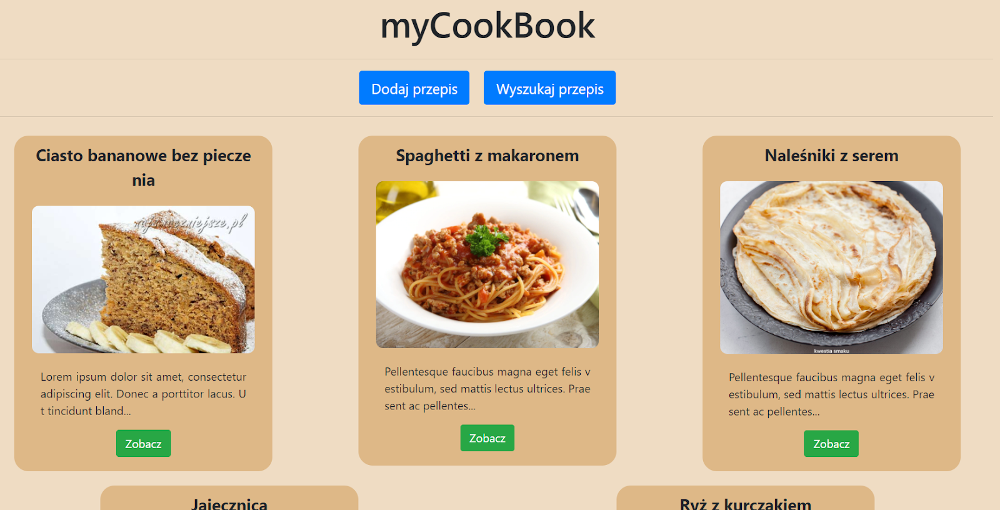
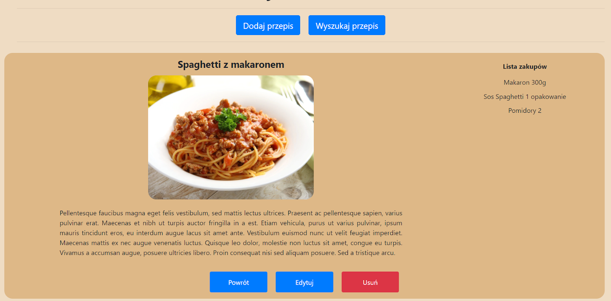
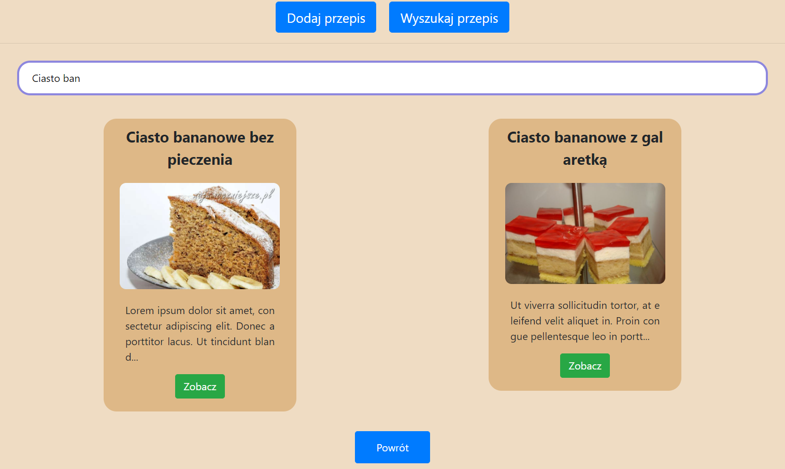

# myCookBook
<br/><br/>
This is a Cookbook - Single Page Application (SPA). The application allows recipe management (add, edit, search by name etc.)

## Technologies
* React
* Express.js (to creating API server)
* Bootstrap
* HTML&CSS

## Features
* Add, edit and delete recipes
* Ingredient list management in each recipe
* Recipe search
* List of recipes in a short form
* Detailed view of the recipe
* RWD (Responsive web design)

## Screenshots




## Setup
* Clone this repo to your desktop
```
git clone https://github.com/m-uszynski/myCookBook.git
```
* Run `npm install` to install all the dependencies
* Run server (with REST methods) `node -r esm server.js`
* Run `npm start` to start the application
* Open `http://localhost:3000` to view it in the browser
